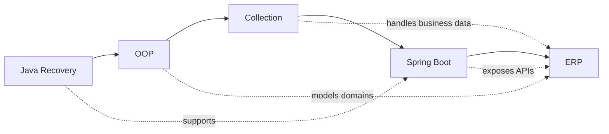

# Knowledge Map

This map shows the long-term learning connection for Java-Backend-Master-Course.

`MASTER_BOOK.md` remains the authority for curriculum order.

## Learning Chain

- Java builds syntax and basic problem-solving ability.
- OOP builds domain modeling ability.
- Collection builds business data handling ability.
- Spring Boot builds backend API ability.
- ERP combines the full backend stack into business software.
